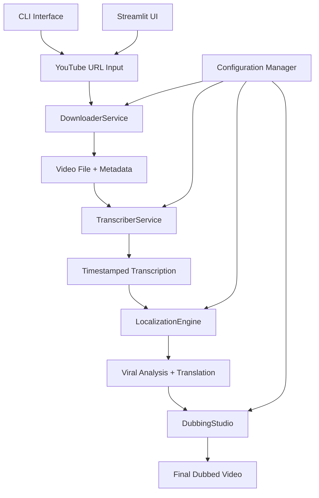

# Design Document

## Overview

Viral-Local is a Python-based automated video localization pipeline that transforms YouTube content into multi-language dubbed videos. The system employs a modular architecture with distinct services for video processing, AI-powered content analysis, translation, and audio-video synthesis. The design prioritizes hackathon feasibility while maintaining production-ready architectural principles, enabling rapid development and deployment within competition constraints.

The system processes videos through a sequential pipeline: URL input → video download → audio extraction → transcription → viral segment analysis → translation → text-to-speech → video assembly → final output. Each stage is designed for independent testing and optimization, supporting both command-line and web-based interfaces.

## Architecture

The system follows a service-oriented architecture with clear separation of concerns:



**Core Architecture Principles:**
- **Modularity**: Each service handles a single responsibility
- **Configurability**: External configuration for API keys, model parameters, and output settings
- **Error Resilience**: Graceful failure handling with detailed logging
- **Performance Optimization**: Parallel processing where possible, caching of intermediate results
- **Extensibility**: Plugin architecture for adding new languages or AI models

## Components and Interfaces

### DownloaderService

**Purpose**: Handles YouTube video acquisition and preprocessing

**Key Methods:**
```python
class DownloaderService:
    def download_video(self, url: str) -> VideoFile
    def extract_audio(self, video_file: VideoFile) -> AudioFile
    def validate_url(self, url: str) -> bool
    def get_video_metadata(self, url: str) -> VideoMetadata
```

**Implementation Details:**
- Uses yt-dlp for robust YouTube downloading with format selection
- Implements retry logic with exponential backoff for network failures
- Validates video duration against 30-minute limit before download
- Extracts audio in WAV format optimized for Whisper processing
- Handles various YouTube URL formats (standard, shortened, playlist)

**Error Handling:**
- Invalid URLs return structured error responses
- Network timeouts trigger automatic retries
- Unsupported video formats fallback to best available quality

### TranscriberService

**Purpose**: Converts audio to timestamped text transcription

**Key Methods:**
```python
class TranscriberService:
    def transcribe_audio(self, audio_file: AudioFile) -> Transcription
    def detect_language(self, audio_file: AudioFile) -> str
    def segment_transcription(self, transcription: Transcription) -> List[TranscriptSegment]
```

**Implementation Details:**
- Integrates OpenAI Whisper model (base or small for speed vs accuracy trade-off)
- Generates word-level timestamps for precise audio-video synchronization
- Automatically detects source language with confidence scoring
- Segments transcription into logical chunks for translation processing
- Implements speaker diarization for multi-speaker content

**Performance Optimizations:**
- GPU acceleration when available
- Audio preprocessing for optimal Whisper input
- Batch processing for longer videos

### LocalizationEngine

**Purpose**: Analyzes content virality and performs intelligent translation

**Key Methods:**
```python
class LocalizationEngine:
    def analyze_viral_segments(self, transcription: Transcription) -> List[ViralSegment]
    def translate_content(self, segments: List[TranscriptSegment], target_lang: str) -> List[TranslatedSegment]
    def optimize_translation_quality(self, segments: List[TranslatedSegment]) -> List[TranslatedSegment]
```

**Implementation Details:**
- Uses Gemini-1.5-Flash or Groq API for content analysis and translation
- Implements viral segment scoring based on:
  - Emotional intensity markers
  - Information density metrics
  - Engagement prediction algorithms
  - Technical content complexity
- Maintains context across segments for coherent translation
- Applies cultural localization rules for Indian languages
- Preserves technical terminology while adapting cultural references

**AI Integration:**
- Structured prompts for consistent viral analysis
- Context-aware translation maintaining speaker tone
- Fallback strategies for API failures or rate limiting

### DubbingStudio

**Purpose**: Synthesizes localized audio and assembles final video

**Key Methods:**
```python
class DubbingStudio:
    def generate_speech(self, translated_segments: List[TranslatedSegment], voice_config: VoiceConfig) -> AudioFile
    def synchronize_audio(self, new_audio: AudioFile, original_timing: TimingData) -> AudioFile
    def merge_audio_video(self, video: VideoFile, audio: AudioFile) -> VideoFile
```

**Implementation Details:**
- Integrates Edge-TTS or Kokoro-82M for natural speech synthesis
- Implements voice selection logic matching original speaker characteristics
- Applies audio processing for consistent volume and quality
- Uses MoviePy for precise audio-video synchronization
- Maintains original video quality and metadata in final output

**Audio Processing Pipeline:**
- Text preprocessing for optimal TTS input
- Voice characteristic matching (gender, age, tone)
- Audio timing adjustment for natural speech rhythm
- Quality normalization and noise reduction

## Data Models

### Core Data Structures

```python
@dataclass
class VideoFile:
    file_path: str
    duration: float
    resolution: Tuple[int, int]
    format: str
    metadata: Dict[str, Any]

@dataclass
class TranscriptSegment:
    text: str
    start_time: float
    end_time: float
    confidence: float
    speaker_id: Optional[str]

@dataclass
class ViralSegment:
    segment: TranscriptSegment
    viral_score: float
    engagement_factors: List[str]
    priority_level: int

@dataclass
class TranslatedSegment:
    original_segment: TranscriptSegment
    translated_text: str
    target_language: str
    quality_score: float
    cultural_adaptations: List[str]

@dataclass
class VoiceConfig:
    language: str
    gender: str
    age_range: str
    speaking_rate: float
    pitch_adjustment: float
```

### Configuration Schema

```python
@dataclass
class SystemConfig:
    # API Configuration
    gemini_api_key: str
    groq_api_key: Optional[str]
    
    # Model Settings
    whisper_model_size: str = "base"
    tts_engine: str = "edge-tts"  # or "kokoro-82m"
    
    # Processing Limits
    max_video_duration: int = 1800  # 30 minutes
    max_concurrent_requests: int = 3
    
    # Quality Settings
    target_audio_quality: str = "high"
    video_output_format: str = "mp4"
    
    # Language Support
    supported_languages: List[str] = field(default_factory=lambda: ["hi", "bn", "ta"])
```

## Error Handling

### Error Classification and Response Strategy

**Network Errors:**
- YouTube download failures: Retry with exponential backoff, fallback to alternative extractors
- API timeouts: Queue requests, implement circuit breaker pattern
- Rate limiting: Implement token bucket algorithm with user notification

**Processing Errors:**
- Audio quality issues: Provide preprocessing suggestions, attempt noise reduction
- Translation failures: Retry with simplified prompts, fallback to alternative APIs
- TTS generation errors: Switch voice models, adjust speech parameters

**System Errors:**
- Memory constraints: Implement streaming processing for large files
- Disk space issues: Cleanup temporary files, compress intermediate results
- Configuration errors: Validate settings on startup, provide clear error messages

### Logging and Monitoring

```python
class ErrorHandler:
    def log_error(self, error: Exception, context: Dict[str, Any]) -> None
    def notify_user(self, error_type: str, message: str, suggestions: List[str]) -> None
    def recover_from_failure(self, stage: str, intermediate_data: Dict[str, Any]) -> bool
```

## Testing Strategy

*A property is a characteristic or behavior that should hold true across all valid executions of a system—essentially, a formal statement about what the system should do. Properties serve as the bridge between human-readable specifications and machine-verifiable correctness guarantees.*

### Correctness Properties

Before defining the correctness properties, I need to analyze the acceptance criteria from the requirements to determine which ones are testable as properties, examples, or edge cases.

#### Property 1: End-to-End Processing Pipeline
*For any* valid YouTube URL and target language, the complete processing pipeline (download → transcription → translation → speech generation → video assembly) should produce a final MP4 video file
**Validates: Requirements 1.1, 1.3, 2.1, 4.1, 5.1, 6.1, 6.3**

#### Property 2: Input Validation and Error Handling
*For any* invalid input (malformed URLs, unsupported formats, oversized videos), the system should return descriptive error messages without crashing
**Validates: Requirements 1.2, 1.4, 2.3, 8.4**

#### Property 3: Language Support Completeness
*For any* supported target language (Hindi, Bengali, Tamil), the system should successfully perform translation and generate appropriate voice synthesis
**Validates: Requirements 4.2, 5.4**

#### Property 4: Timing and Quality Preservation
*For any* processed video, the output should maintain original video quality, resolution, and timing synchronization between audio and video tracks
**Validates: Requirements 4.4, 5.3, 6.2, 6.4**

#### Property 5: Viral Analysis Consistency
*For any* transcribed content, viral segment analysis should produce scored segments with rationale, and identified viral segments should receive enhanced processing
**Validates: Requirements 3.1, 3.2, 3.3, 3.4**

#### Property 6: Cultural and Technical Adaptation
*For any* content containing technical terms or cultural references, translation should preserve technical accuracy while adapting cultural elements appropriately for the target audience
**Validates: Requirements 4.3, 10.1, 10.3, 10.5**

#### Property 7: Audio Generation Fidelity
*For any* translated text, generated speech should match original speaker characteristics (gender, tone) and preserve emotional inflection
**Validates: Requirements 5.2, 10.4**

#### Property 8: System Resilience and Recovery
*For any* processing failure or resource constraint, the system should implement appropriate retry mechanisms, preserve intermediate results, and provide detailed error logging
**Validates: Requirements 4.5, 5.5, 7.4, 9.1, 9.2, 9.3, 9.5**

#### Property 9: User Interface Responsiveness
*For any* processing operation, the system should provide progress indicators, completion estimates, and allow preview of translation quality before final generation
**Validates: Requirements 7.3, 8.3, 8.5**

#### Property 10: Performance Under Load
*For any* multiple concurrent requests, the system should handle them efficiently using caching and resource management without significant performance degradation
**Validates: Requirements 7.2, 7.5**

### Testing Strategy

**Dual Testing Approach:**
The system requires both unit testing and property-based testing for comprehensive coverage:

**Unit Testing Focus:**
- Specific API integration examples (YouTube download, Whisper transcription, Gemini translation)
- Edge cases for each processing stage (empty audio, network timeouts, malformed responses)
- Interface validation (CLI parameter parsing, Streamlit UI components)
- Configuration and setup validation
- Error message formatting and user guidance

**Property-Based Testing Focus:**
- Universal properties across all valid inputs using generated test data
- Comprehensive input coverage through randomization of URLs, languages, and content types
- End-to-end pipeline validation with varied input characteristics
- Performance and resource usage patterns under different load conditions

**Property-Based Testing Configuration:**
- **Framework**: Use `hypothesis` for Python property-based testing
- **Test Iterations**: Minimum 100 iterations per property test to ensure statistical coverage
- **Test Tagging**: Each property test tagged with format: **Feature: viral-local, Property {number}: {property_text}**
- **Data Generation**: Custom generators for YouTube URLs, audio content, and multilingual text
- **Shrinking Strategy**: Implement minimal failing examples for debugging

**Integration Testing:**
- End-to-end pipeline testing with real YouTube videos
- API integration testing with actual service endpoints
- Performance benchmarking with various video lengths and qualities
- Cross-platform compatibility testing (Windows, macOS, Linux)

**Test Environment Setup:**
- Mock services for API testing to avoid rate limits during development
- Test video corpus with known characteristics for consistent validation
- Automated test data cleanup and resource management
- Continuous integration pipeline with property test execution

The testing strategy ensures that both concrete examples work correctly (unit tests) and that universal properties hold across all possible inputs (property tests), providing comprehensive validation of the system's correctness and reliability.